# 약 복용 시간 추천 서비스 - 와이어프레임

## 목차
- [1. 개요](#1-개요)
- [2. 화면 구조 맵](#2-화면-구조-맵)
- [3. 공통 요소](#3-공통-요소)
- [4. 화면별 상세 설계](#4-화면별-상세-설계)
  - [4.1 인증 및 메인 영역](#41-인증-및-메인-영역)
  - [4.2 약 검색 및 정보](#42-약-검색-및-정보)
  - [4.3 약 관리](#43-약-관리)
  - [4.4 부가 기능](#44-부가-기능)

---

## 1. 개요

### 1.1 서비스 소개
약 복용 시간 추천 서비스의 웹 기반 사용자 인터페이스 설계 문서입니다.

### 1.2 디자인 원칙
- **명확성**: 의료 정보의 정확한 전달
- **신뢰성**: 전문적이고 깔끔한 디자인
- **접근성**: 모든 연령대가 쉽게 사용
- **투명성**: 서비스 범위와 한계 명시

### 1.3 색상 팔레트
- **Primary**: #7FA99B (세이지 그린) - 자연스럽고 안정적인 느낌
- **Secondary**: #F8F9F6 (크림 화이트) - 부드러운 배경
- **Accent**: #E9B872 (따뜻한 골드) - 긍정적 액션
- **Success**: #9CAF88 (올리브 그린) - 완료/성공
- **Warning**: #E8A87C (복숭아 오렌지) - 주의사항
- **Danger**: #D48A88 (부드러운 코랄) - 위험/삭제
- **Text**: #3A4045 (다크 차콜) - 본문
- **Text Light**: #6B7280 (그레이) - 부가 정보

---

## 2. 화면 구조 맵

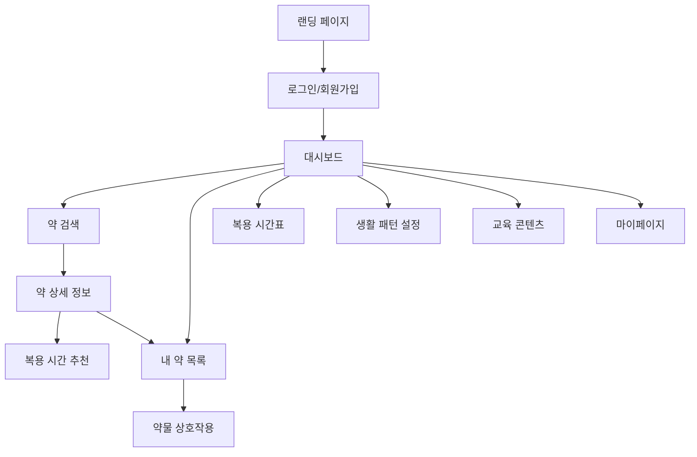

---

## 3. 공통 요소

### 3.1 헤더 (Header)

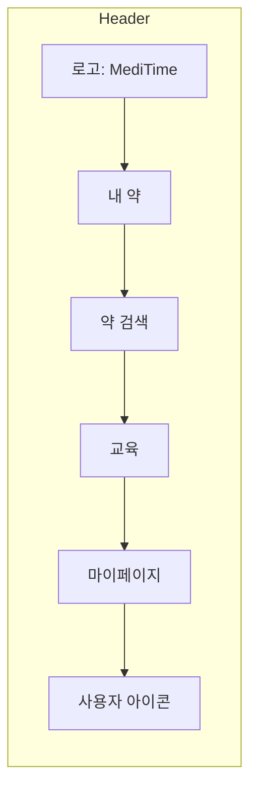

**구성 요소**:
- **로고**: 좌측 상단, "MediTime" 텍스트 + 약 아이콘
- **네비게이션 메뉴**: 중앙 정렬
  - 내 약
  - 약 검색
  - 교육
  - 마이페이지
- **사용자 정보**: 우측 상단 (프로필 아이콘 + 이름)

**스타일**:
- 높이: 64px
- 배경: 크림 화이트 (#F8F9F6)
- 하단 테두리: 1px solid #D4D9D0
- 메뉴 항목: 16px, Medium 폰트
- 호버 시: 세이지 그린 (#7FA99B) 하이라이트

### 3.2 푸터 (Footer)

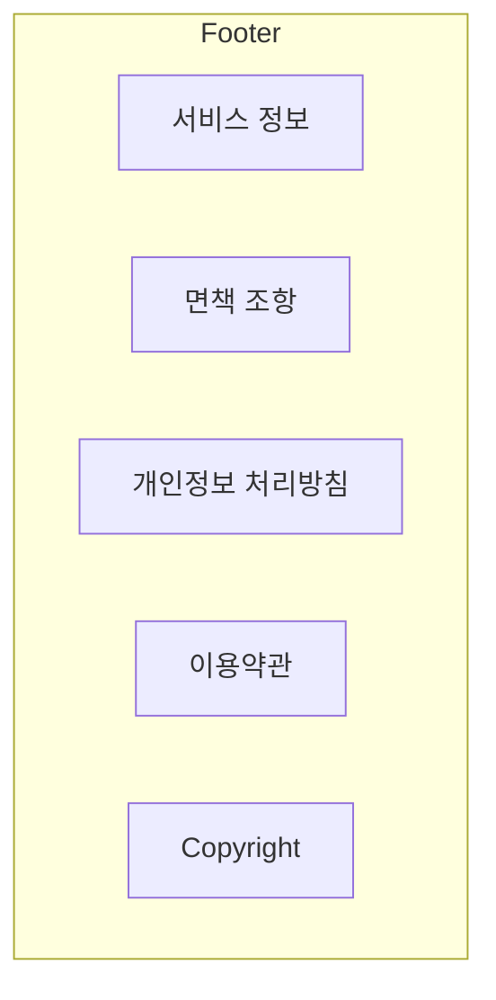

**구성 요소**:
- 서비스 소개 및 연락처
- 면책 조항: "본 서비스는 교육적 정보 제공 목적입니다"
- 개인정보 처리방침 링크
- 이용약관 링크
- 저작권 정보

**스타일**:
- 배경: #E8EBE5
- 패딩: 48px 상하
- 텍스트: #6B7280, 14px

### 3.3 고지 배너 (Disclaimer Banner)

**중요 페이지에 표시**:
```
ℹ️ 본 서비스는 교육적 정보 제공 목적이며, 의료 행위를 대체하지 않습니다.
복용 시간 변경이나 치료 결정은 반드시 의료진과 상담하세요.
```

**스타일**:
- 배경: #FEF8E7 (연한 크림)
- 테두리: #E9B872
- 아이콘: 정보 아이콘 (ℹ️)
- 위치: 콘텐츠 영역 상단

---

## 4. 화면별 상세 설계

## 4.1 인증 및 메인 영역

### 4.1.1 랜딩 페이지

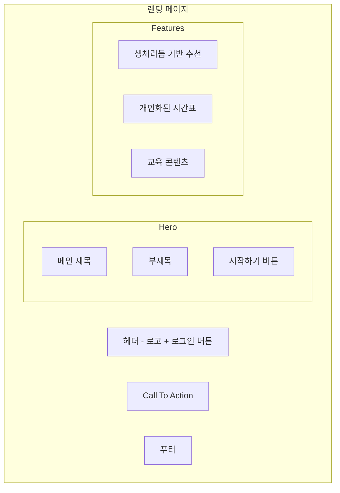

**레이아웃**:

**1. 히어로 섹션** (전체 너비, 중앙 정렬)
- **메인 제목**: "약 복용, 이제 올바른 시간에"
  - 폰트: 48px, Bold
  - 색상: #1F2937
  - 위치: 화면 상단에서 200px
- **부제목**: "생체리듬을 고려한 과학적인 복용 시간 가이드"
  - 폰트: 24px, Regular
  - 색상: #6B7280
  - 마진: 제목 아래 24px
- **CTA 버튼**: "시작하기"
  - 크기: 160px × 56px
  - 배경: #7FA99B (세이지 그린)
  - 텍스트: 흰색, 18px, Bold
  - 둥근 모서리: 8px
  - 호버: #6B8E7F (진한 세이지)
  - 마진: 부제목 아래 40px

**2. 주요 기능 섹션** (3열 그리드)
- **카드 레이아웃**: 최대 너비 1200px, 중앙 정렬
- **각 카드**:
  - 너비: 360px
  - 높이: 280px
  - 배경: 흰색
  - 테두리: 1px solid #E5E7EB
  - 둥근 모서리: 12px
  - 패딩: 32px
  - 그림자: 0 1px 3px rgba(0,0,0,0.1)
  
**카드 1: 생체리듬 기반 추천**
- 아이콘: 🌙 (달 이모지 또는 시계 아이콘)
- 제목: "생체리듬 기반 추천"
- 설명: "시간약리학을 기반으로 한 과학적인 복용 시간 가이드를 제공합니다"

**카드 2: 개인화된 시간표**
- 아이콘: 📅 (달력 아이콘)
- 제목: "개인화된 시간표"
- 설명: "회원님의 생활 패턴에 맞춘 맞춤형 복용 시간표를 만들어드립니다"

**카드 3: 교육 콘텐츠**
- 아이콘: 📚 (책 아이콘)
- 제목: "교육 콘텐츠"
- 설명: "약물과 생체리듬에 대한 쉬운 설명으로 이해도를 높입니다"

**3. 신뢰 섹션**
- 배경: #F9FAFB
- 패딩: 80px 상하
- 내용:
  - "식품의약품안전처 데이터 기반"
  - "개인정보 보호 철저"
  - "의료진 상담 독려"

---

### 4.1.2 로그인 / 회원가입

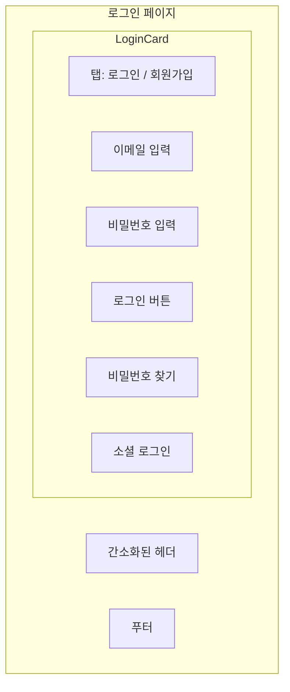

**레이아웃**:

**중앙 카드** (최대 너비 440px)
- 배경: 흰색
- 테두리: 1px solid #E5E7EB
- 둥근 모서리: 16px
- 패딩: 48px
- 그림자: 0 4px 6px rgba(0,0,0,0.1)
- 화면 중앙 정렬 (세로, 가로)

**1. 탭 메뉴**
- 로그인 / 회원가입 전환
- 선택된 탭: 하단 2px 파란색 바
- 폰트: 18px, Medium

**2. 로그인 폼**
- **이메일 입력 필드**:
  - 라벨: "이메일"
  - 플레이스홀더: "example@email.com"
  - 높이: 48px
  - 테두리: 1px solid #D1D5DB
  - 둥근 모서리: 8px
  - 포커스: 파란색 테두리
  
- **비밀번호 입력 필드**:
  - 라벨: "비밀번호"
  - 타입: password
  - 높이: 48px
  - 마진 상단: 20px
  
- **로그인 버튼**:
  - 텍스트: "로그인"
  - 너비: 100%
  - 높이: 52px
  - 배경: #7FA99B
  - 텍스트: 흰색, 16px, Bold
  - 마진 상단: 32px
  
- **비밀번호 찾기**:
  - 링크, 우측 정렬
  - 색상: #6B7280
  - 폰트: 14px
  - 마진 상단: 16px

**3. 소셜 로그인** (선택사항)
- 구분선: "또는"
- 버튼: 구글, 네이버, 카카오
- 각 버튼: 아이콘 + 텍스트

**4. 회원가입 탭**
- 추가 필드:
  - 이름 입력
  - 비밀번호 확인
  - 이용약관 동의 체크박스
  - 개인정보 처리방침 동의 체크박스

---

### 4.1.3 대시보드 / 홈

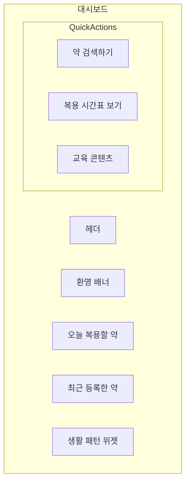

**레이아웃**: 2열 그리드 (메인 콘텐츠 70% + 사이드바 30%)

**1. 환영 배너**
- 전체 너비
- 배경: 그라데이션 (#E8F0EC → #D4E5DC)
- 높이: 120px
- 패딩: 24px
- 내용:
  - "김영수님, 안녕하세요 👋"
  - 폰트: 28px, Bold
  - 부제: "오늘도 건강한 하루 되세요"
  - 폰트: 16px, Regular

**2. 고지 배너** (환영 배너 하단)
```
ℹ️ 본 서비스는 교육적 정보 제공 목적입니다. 
복용 시간 변경은 반드시 의료진과 상담하세요.
```

**3. 빠른 실행 (메인 영역)**
- 3개 카드, 가로 배열
- 각 카드:
  - 너비: 32%
  - 높이: 140px
  - 배경: 흰색
  - 테두리: 2px solid #E5E7EB
  - 둥근 모서리: 12px
  - 호버: 파란색 테두리
  - 커서: pointer

**카드 내용**:
- 아이콘 (상단, 48px, 세이지 그린)
- 텍스트 (하단, 18px, Medium)
- "약 검색하기" / "복용 시간표 보기" / "교육 콘텐츠"

**4. 오늘 복용할 약 (메인 영역)**
- 제목: "오늘 복용할 약" (24px, Bold)
- 마진 상단: 40px

**약 카드 리스트** (세로 배열):
각 카드:
- 배경: 흰색
- 테두리: 1px solid #E5E7EB
- 패딩: 20px
- 둥근 모서리: 8px
- 마진 하단: 12px

**카드 내용**:
```
[아침 08:00] 🔔
약 이름: 타이레놀 (500mg)
복용량: 1정
[복용 완료] 버튼 (올리브 그린)
```

**5. 최근 등록한 약 (메인 영역)**
- 제목: "최근 등록한 약" (20px, Bold)
- 마진 상단: 40px
- 리스트 형태:
  - 약 이름
  - 등록 날짜
  - [상세보기] 링크

**6. 생활 패턴 위젯 (사이드바)**
- 배경: #E8EBE5
- 패딩: 24px
- 둥근 모서리: 12px

**내용**:
- 제목: "생활 패턴" (18px, Bold)
- 기상 시간: 07:00
- 취침 시간: 23:00
- 주요 식사 시간: 08:00, 12:00, 18:00
- [수정하기] 버튼

---

## 4.2 약 검색 및 정보

### 4.2.1 약 검색

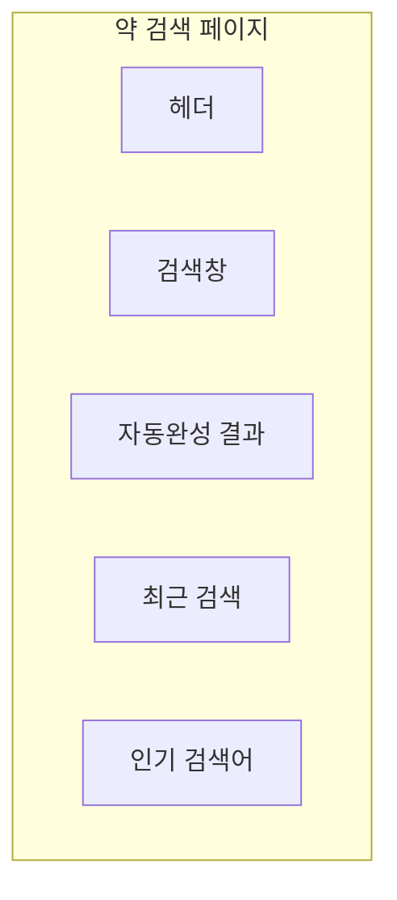

**레이아웃**: 중앙 정렬, 최대 너비 800px

**1. 검색창**
- 위치: 화면 상단에서 120px
- 너비: 100% (최대 800px)
- 높이: 64px
- 배경: 흰색
- 테두리: 2px solid #D1D5DB
- 둥근 모서리: 32px
- 그림자: 0 2px 8px rgba(0,0,0,0.1)

**구성**:
- 돋보기 아이콘 (좌측, 24px)
- 입력 필드:
  - 플레이스홀더: "약 이름을 입력하세요"
  - 폰트: 18px
  - 색상: #6B7280
- [X] 버튼 (우측, 입력 시 표시)

**2. 자동완성 드롭다운**
- 검색창 바로 아래 표시
- 배경: 흰색
- 테두리: 1px solid #E5E7EB
- 둥근 모서리: 12px (하단만)
- 그림자: 0 4px 12px rgba(0,0,0,0.15)
- 최대 높이: 400px
- 스크롤 가능

**각 항목**:
```
[약 아이콘] 타이레놀 500mg
           (해열진통제)
[화살표]
```
- 높이: 64px
- 패딩: 12px 16px
- 호버: #F9FAFB 배경

**3. 최근 검색** (검색 전)
- 제목: "최근 검색" (18px, Medium)
- 마진 상단: 40px
- 태그 형태:
  - 배경: #F3F4F6
  - 텍스트: #4B5563
  - 패딩: 8px 16px
  - 둥근 모서리: 20px
  - 인라인 배열
  - [X] 삭제 버튼

**4. 인기 검색어**
- 제목: "인기 검색어" (18px, Medium)
- 마진 상단: 32px
- 번호 리스트:
  1. 타이레놀
  2. 아스피린
  3. 게보린
  (등)
- 각 항목 클릭 시 검색

---

### 4.2.2 약 상세 정보

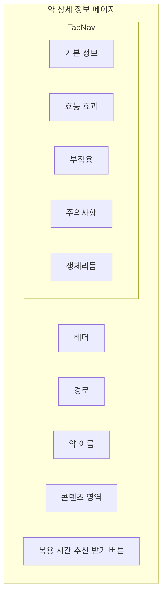

**레이아웃**: 최대 너비 1200px, 중앙 정렬

**1. 경로 (Breadcrumb)**
```
홈 > 약 검색 > 타이레놀
```
- 폰트: 14px
- 색상: #6B7280
- 구분자: >
- 현재 페이지: Bold

**2. 약 이름 헤더**
- 배경: 흰색
- 패딩: 32px
- 테두리 하단: 1px solid #E5E7EB

**내용**:
- 약 이름: "타이레놀 500mg" (32px, Bold)
- 성분명: "아세트아미노펜" (18px, Regular, #6B7280)
- [내 약에 추가] 버튼 (우측)
  - 배경: #10B981 (초록색)
  - 텍스트: 흰색
  - 크기: 140px × 44px

**3. 탭 네비게이션**
- 배경: #F9FAFB
- 높이: 56px
- 테두리 하단: 1px solid #E5E7EB

**탭 항목**:
- 기본 정보 / 효능 효과 / 부작용 / 주의사항 / 생체리듬
- 폰트: 16px, Medium
- 선택된 탭: 
  - 텍스트: #7FA99B (세이지 그린)
  - 하단 바: 3px solid #7FA99B
- 미선택 탭: #6B7280

**4. 콘텐츠 영역**

**탭 1: 기본 정보**
```
[카드 레이아웃]

📋 기본 정보
─────────────
제품명: 타이레놀 500mg
성분명: 아세트아미노펜
제조사: 한국얀센
분류: 해열진통제

💊 복용 방법
─────────────
성인: 1회 1~2정, 1일 3~4회
최대 용량: 1일 4000mg을 넘지 않도록 주의
```

**탭 2: 효능 효과**
- 글머리 기호 리스트
- 폰트: 16px, 줄간격 1.8
- 내용: 두통, 근육통, 치통, 발열 등

**탭 3: 부작용**
- 경고 아이콘 사용
- 빈도별 구분:
  - **흔한 부작용** (1% 이상)
  - **드문 부작용** (1% 미만)
- 각 항목: 증상 + 설명

**탭 4: 주의사항**
```
⚠️ 주의사항

1. 다음과 같은 경우 복용하지 마세요
   • 간 질환이 있는 경우
   • 알코올 복용 중인 경우
   
2. 다음과 같은 경우 의사와 상담하세요
   • 임신 중이거나 수유 중인 경우
   • 다른 약물을 복용 중인 경우
```

**탭 5: 생체리듬**
```
🌙 생체리듬과 복용 시간

이 약은 시간에 크게 영향받지 않는 약물입니다.
증상이 발생했을 때 복용하시면 됩니다.

💡 참고사항
• 식후 복용 시 위장 보호 효과
• 취침 전 복용 시 통증으로 인한 수면 방해 예방
```

**5. 고정 하단 바**
- 위치: 화면 하단 고정
- 배경: 흰색
- 높이: 80px
- 그림자: 0 -2px 8px rgba(0,0,0,0.1)

**내용**:
- [복용 시간 추천 받기] 버튼
  - 배경: #7FA99B (세이지 그린)
  - 텍스트: 흰색, 18px, Bold
  - 크기: 240px × 56px
  - 위치: 중앙 정렬

---

### 4.2.3 복용 시간 추천 결과

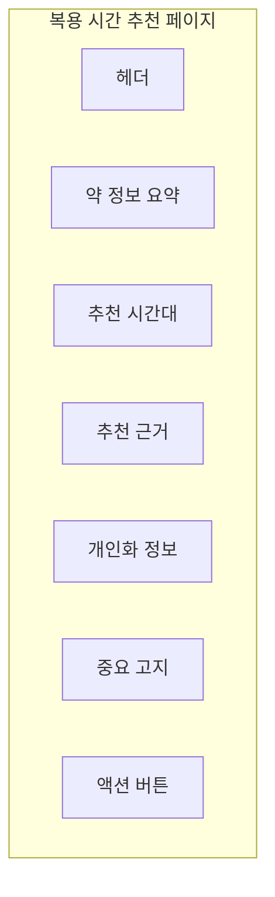

**레이아웃**: 최대 너비 900px, 중앙 정렬

**1. 약 정보 요약 카드**
- 배경: #E8EBE5
- 패딩: 24px
- 둥근 모서리: 12px
- 마진 하단: 32px

**내용**:
```
[약 아이콘] 타이레놀 500mg
해열진통제 | 아세트아미노펜
```

**2. 추천 시간대 (강조 섹션)**
- 배경: 흰색
- 테두리: 2px solid #7FA99B
- 패딩: 32px
- 둥근 모서리: 16px
- 그림자: 0 4px 12px rgba(127,169,155,0.15)

**내용**:
```
📌 일반적으로 고려되는 복용 시간

증상 발생 시 복용

이 약은 특정 시간대에 복용할 필요가 없으며,
두통, 발열 등 증상이 나타날 때 복용하시면 됩니다.
```
- 제목: 20px, Bold
- 시간: 36px, Bold, #7FA99B
- 설명: 16px, 줄간격 1.8

**3. 추천 근거**
- 제목: "💡 이유" (20px, Bold)
- 마진 상단: 40px
- 배경: 흰색
- 테두리: 1px solid #E5E7EB
- 패딩: 24px
- 둥근 모서리: 12px

**내용**:
```
이 약은 증상 완화를 위한 해열진통제로,
특정 시간대 복용이 필요하지 않습니다.

다만, 다음과 같은 경우를 고려할 수 있습니다:

• 식후 복용: 위장 자극을 줄일 수 있습니다
• 취침 전 복용: 통증으로 인한 수면 방해를 예방할 수 있습니다
• 4~6시간 간격 유지: 약효 유지 및 과량 복용 방지
```

**4. 개인화 정보**
- 제목: "⏰ 회원님의 생활패턴을 고려하면" (20px, Bold)
- 마진 상단: 32px
- 배경: #E8F0EC (연한 세이지)
- 패딩: 24px
- 둥근 모서리: 12px

**내용**:
```
회원님의 주요 활동 시간은 오전 9시~오후 6시입니다.

증상이 있을 때 복용하되, 다음 시간대를 참고하세요:
• 출근 전 (오전 8시): 아침 식사 후
• 점심 시간 (오후 12시): 점심 식사 후
• 퇴근 후 (오후 7시): 저녁 식사 후
• 취침 전 (오후 11시): 통증 지속 시

※ 4~6시간 간격을 두고 복용하세요.
```

**5. 개인차 안내**
- 제목: "⚠️ 개인차가 있을 수 있는 이유" (18px, Bold)
- 마진 상단: 32px
- 배경: #FEF8E7 (연한 크림)
- 패딩: 20px
- 둥근 모서리: 12px

**내용** (글머리 기호):
- 약물에 대한 개인의 반응 차이
- 다른 복용 약물과의 상호작용
- 개인의 생활 패턴 및 증상 발생 시간
- 기저 질환 유무

**6. 중요 고지 (강조)**
- 배경: #FADBD8 (연한 코랄)
- 테두리: 2px solid #D48A88
- 패딩: 24px
- 둥근 모서리: 12px
- 마진 상단: 40px

**내용**:
```
❗ 중요

이 정보는 일반적인 참고용 설명입니다.
복용 시간 변경이나 치료 결정은 반드시 의사 또는 약사와 상담하세요.

특히 다음의 경우 반드시 의료진과 상담하세요:
• 3일 이상 증상이 지속되는 경우
• 고열(38.5도 이상)이 계속되는 경우
• 다른 약물을 함께 복용 중인 경우
• 임신 중이거나 수유 중인 경우
```

**7. 액션 버튼 영역**
- 마진 상단: 48px
- 2개 버튼, 가로 배열

**[내 약에 추가하기]** 버튼:
- 배경: #7FA99B
- 텍스트: 흰색
- 크기: 200px × 52px
- 둥근 모서리: 8px

**[다른 약 검색]** 버튼:
- 배경: 흰색
- 텍스트: #7FA99B
- 테두리: 2px solid #7FA99B
- 크기: 200px × 52px
- 둥근 모서리: 8px

---

## 4.3 약 관리

### 4.3.1 생활 패턴 입력/설정

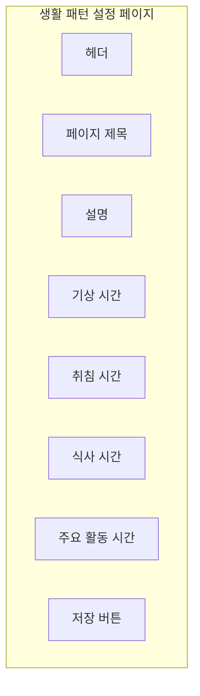

**레이아웃**: 최대 너비 700px, 중앙 정렬

**1. 페이지 제목**
```
⏰ 생활 패턴 설정
```
- 폰트: 32px, Bold
- 아이콘: 시계
- 마진 하단: 16px

**2. 설명**
```
회원님의 생활 패턴을 입력하시면, 
더욱 정확한 복용 시간 추천을 받으실 수 있습니다.
```
- 폰트: 16px, Regular
- 색상: #6B7280
- 마진 하단: 40px

**3. 입력 폼 카드**
- 배경: 흰색
- 테두리: 1px solid #E5E7EB
- 패딩: 40px
- 둥근 모서리: 16px

**기상 시간**:
```
라벨: "기상 시간"
[시간 선택 드롭다운: 07:00] ▼
도움말: "평일 기준 평균 기상 시간을 입력하세요"
```
- 라벨: 16px, Medium
- 입력 필드: 높이 48px
- 도움말: 14px, #6B7280

**취침 시간**:
```
라벨: "취침 시간"
[시간 선택 드롭다운: 23:00] ▼
도움말: "평일 기준 평균 취침 시간을 입력하세요"
```
- 마진 상단: 28px

**식사 시간**:
```
라벨: "주요 식사 시간"

아침 식사: [08:00] ▼
점심 식사: [12:00] ▼
저녁 식사: [18:00] ▼
```
- 마진 상단: 28px
- 각 식사 시간 마진: 12px

**주요 활동 시간**:
```
라벨: "주요 활동 시간"

출근/등교 시간: [09:00] ▼
퇴근/하교 시간: [18:00] ▼

☑️ 운전을 자주 합니다
☑️ 집중이 필요한 업무를 합니다
☐ 교대 근무를 합니다
```
- 마진 상단: 28px
- 체크박스: 추가 정보 수집

**4. 시간 시각화**
- 24시간 타임라인 그래프
- 설정된 시간 표시
- 색상 구분:
  - 수면 시간: 진한 회색
  - 활동 시간: 파란색
  - 식사 시간: 초록색 마커

**5. 저장 버튼**
- 배경: #7FA99B
- 텍스트: 흰색, 18px, Bold
- 크기: 전체 너비 × 56px
- 마진 상단: 40px
- 둥근 모서리: 8px

**6. 추가 안내**
- 마진 상단: 24px
- 배경: #E8EBE5
- 패딩: 16px
- 둥근 모서리: 8px

```
💡 팁
생활 패턴은 언제든지 수정할 수 있습니다.
더 정확한 추천을 위해 실제 생활 패턴에 가깝게 입력해주세요.
```

---

### 4.3.2 내 약 목록

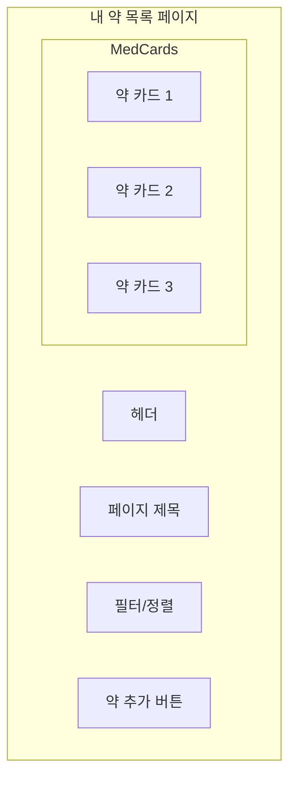

**레이아웃**: 최대 너비 1200px

**1. 페이지 제목 영역**
```
💊 내 약 목록        [+ 약 추가하기] 버튼
```
- 제목: 32px, Bold
- 버튼: 우측 상단
  - 배경: #7FA99B
  - 크기: 160px × 44px

**2. 필터 및 정렬**
- 배경: #E8EBE5
- 높이: 64px
- 패딩: 16px
- 마진 하단: 24px

**내용**:
```
필터: [전체 ▼] [처방약] [상비약] [만성질환]
정렬: [최근 등록순 ▼]
검색: [🔍 약 이름 검색]
```

**3. 약 카드 (그리드 레이아웃, 2열)**
- 각 카드 너비: 48%
- 마진: 16px
- 배경: 흰색
- 테두리: 1px solid #E5E7EB
- 패딩: 24px
- 둥근 모서리: 12px
- 호버: 그림자 효과

**카드 구성**:

**상단 영역**:
```
[약 아이콘]  타이레놀 500mg                [⋮ 메뉴]
            아세트아미노펜
            해열진통제
```
- 약 이름: 20px, Bold
- 성분명: 14px, #6B7280
- 분류: 14px, #6B7280

**추천 시간 영역**:
```
⏰ 권장 복용 시간

증상 발생 시 복용
• 식후 복용 권장
• 4~6시간 간격 유지
```
- 배경: #E8F0EC
- 패딩: 16px
- 둥근 모서리: 8px
- 마진 상단: 16px

**하단 영역**:
```
등록일: 2026.01.15        [상세보기] [복용 기록]
```
- 텍스트: 14px, #6B7280
- 버튼: 16px, 파란색 텍스트

**메뉴 드롭다운** (⋮ 클릭 시):
```
수정하기
복용 기록 보기
삭제하기
```

**4. 빈 상태**
(등록된 약이 없을 때)
```
[약 아이콘]

아직 등록된 약이 없습니다
약을 추가하여 복용 시간 추천을 받아보세요

[약 검색하기] 버튼
```
- 중앙 정렬
- 아이콘: 128px, 회색
- 텍스트: 18px, #6B7280

---

### 4.3.3 내 복용 시간표

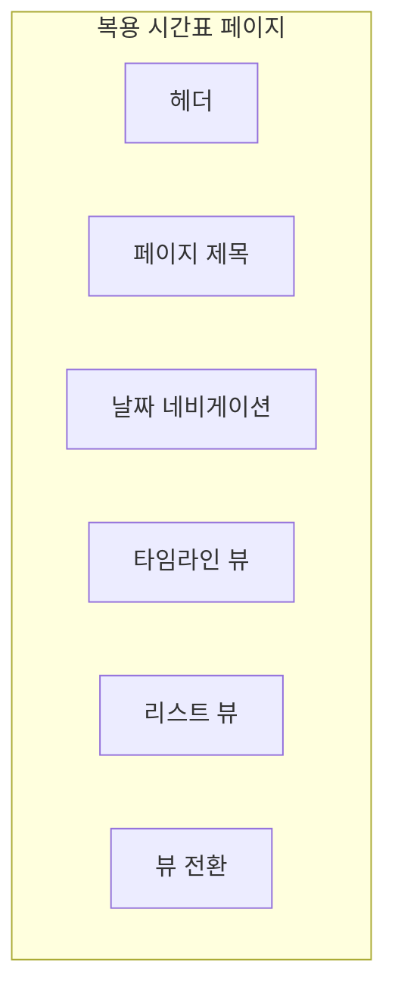

**레이아웃**: 최대 너비 1000px

**1. 페이지 제목 영역**
```
📅 내 복용 시간표
```
- 폰트: 32px, Bold
- 마진 하단: 24px

**2. 날짜 네비게이션**
```
[◀] 2026년 1월 22일 (수) [▶]
```
- 중앙 정렬
- 날짜: 24px, Bold
- 화살표 버튼: 48px × 48px
- 오늘 날짜: 세이지 그린 강조

**3. 뷰 전환 토글**
```
[타임라인 뷰] / [리스트 뷰]
```
- 우측 정렬
- 토글 스위치 형태

**4. 타임라인 뷰**

**시간축** (세로 배열):
```
00:00 ─────────────────────
      
06:00 ─────────────────────
      [💊 타이레놀]
      08:00 - 아침 식사 후
      
12:00 ─────────────────────
      [💊 혈압약]
      12:30 - 점심 식사 후
      
18:00 ─────────────────────
      [💊 소화제]
      18:00 - 저녁 식사 전
      
24:00 ─────────────────────
```

**스타일**:
- 시간 라벨: 좌측, 16px, #6B7280
- 시간선: 1px solid #E5E7EB
- 약 카드:
  - 배경: 흰색
  - 테두리: 2px solid (시간대별 색상)
    - 아침: #E9B872 (따뜻한 골드)
    - 점심: #9CAF88 (올리브 그린)
    - 저녁: #7FA99B (세이지 그린)
    - 취침: #B8A8C8 (연한 라벤더)
  - 패딩: 16px
  - 둥근 모서리: 8px
  - 위치: 시간에 맞게 배치

**약 카드 내용**:
```
💊 타이레놀 500mg
⏰ 08:00 - 아침 식사 후
1정 복용

[복용 완료] ☐
```

**복용 완료 체크**:
- 체크박스
- 체크 시: 올리브 그린, 카드 반투명

**5. 리스트 뷰**

**시간대별 그룹핑**:

```
🌅 아침 (06:00 - 10:00)
─────────────────────────
[💊] 타이레놀 500mg
     08:00 - 아침 식사 후, 1정
     [복용 완료] ☐
     
[💊] 비타민 C
     08:30 - 아침 식사 후, 1정
     [복용 완료] ☑️

🌞 점심 (11:00 - 14:00)
─────────────────────────
[💊] 소화제
     12:00 - 점심 식사 전, 1정
     [복용 완료] ☐

🌆 저녁 (17:00 - 21:00)
─────────────────────────
[💊] 혈압약
     18:00 - 저녁 식사 후, 1정
     [복용 완료] ☐

🌙 취침 전 (21:00 - 24:00)
─────────────────────────
등록된 약이 없습니다.
```

**각 시간대 섹션**:
- 배경: 시간대별 연한 색상
- 패딩: 20px
- 둥근 모서리: 12px
- 마진 하단: 16px

**6. 하단 통계**
```
오늘의 복용 현황
─────────────────
총 4개 약 중 1개 복용 완료 (25%)
[━━━━━━━━━━━━━━━━] 25%
```
- 배경: #E8EBE5
- 패딩: 24px
- 마진 상단: 32px

**7. 추가 기능 버튼**
```
[⬇️ 일정 다운로드] [🖨️ 인쇄하기] [📤 공유하기]
```
- 하단 고정 또는 상단 우측
- 아이콘 + 텍스트 버튼
- 배경: 흰색
- 테두리: 1px solid #E5E7EB

---

## 4.4 부가 기능

### 4.4.1 약물 상호작용 확인

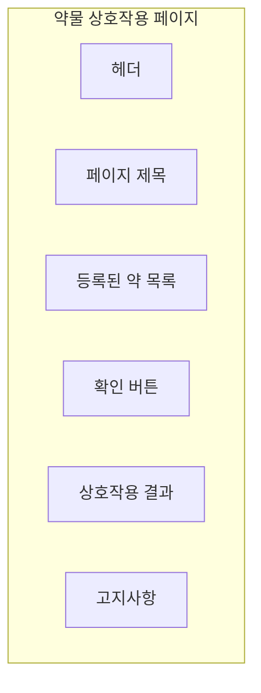

**레이아웃**: 최대 너비 900px, 중앙 정렬

**1. 페이지 제목**
```
⚕️ 약물 상호작용 확인
```
- 폰트: 32px, Bold
- 마진 하단: 16px

**2. 설명**
```
등록된 약물 간 일반적으로 알려진 상호작용을 확인합니다.
새로운 약을 추가할 때마다 확인하는 것을 권장합니다.
```
- 폰트: 16px
- 색상: #6B7280
- 마진 하단: 32px

**3. 등록된 약 목록 카드**
- 배경: 흰색
- 테두리: 1px solid #E5E7EB
- 패딩: 24px
- 둥근 모서리: 12px

**내용**:
```
현재 등록된 약 (4개)

☑️ 타이레놀 500mg (아세트아미노펜)
☑️ 아스피린 100mg (아세틸살리실산)
☑️ 오메프라졸 20mg (위장약)
☑️ 비타민 D 1000IU

[상호작용 확인하기] 버튼
```

**체크박스**:
- 기본: 모두 선택
- 사용자가 확인할 약만 선택 가능

**버튼**:
- 배경: #7FA99B
- 텍스트: 흰색, 18px, Bold
- 크기: 전체 너비 × 56px
- 마진 상단: 24px

**4. 상호작용 결과**

**케이스 1: 상호작용 없음**
```
✅ 좋은 소식입니다!

현재 등록된 약물 간 일반적으로 알려진
중대한 상호작용은 발견되지 않았습니다.

다만, 다음 사항을 주의해주세요:
• 새로운 약 추가 시 반드시 재확인
• 건강기능식품도 상호작용 가능
• 의료진에게 복용 약 목록 제공
```
- 배경: #E3F0E8 (연한 올리브)
- 테두리: 2px solid #9CAF88
- 패딩: 32px
- 둥근 모서리: 12px
- 아이콘: ✅ (큰 체크 마크)

**케이스 2: 주의 필요**
```
⚠️ 주의가 필요합니다

일부 약물 조합에서 주의사항이 있습니다.

[상호작용 카드 1]
─────────────────────────
아스피린 ↔ 타이레놀

심각도: ⚠️ 보통

설명:
두 약물을 함께 복용할 경우, 위장 출혈 위험이
약간 증가할 수 있습니다.

권장사항:
• 식후 복용을 권장합니다
• 위장 불편감 발생 시 의사와 상담
• 장기 복용 시 정기 검진 권장

[상세 정보 보기]
─────────────────────────

[상호작용 카드 2]
...
```

**심각도 표시**:
- 🔴 심각: 코랄 (#D48A88)
- ⚠️ 보통: 복숭아 오렌지 (#E8A87C)
- ℹ️ 경미: 세이지 그린 (#7FA99B)

**5. 고지사항**
- 배경: #FEF8E7 (연한 크림)
- 테두리: 2px solid #E9B872
- 패딩: 24px
- 둥근 모서리: 12px
- 마진 상단: 40px

```
❗ 중요 안내

이 정보는 일반적으로 알려진 약물 상호작용을 
참고용으로 제공합니다.

• 모든 상호작용을 포괄하지 않을 수 있습니다
• 개인의 건강 상태에 따라 다를 수 있습니다
• 새로운 약 복용 전 반드시 의사·약사와 상담하세요
• 현재 복용 중인 모든 약과 건강기능식품을 알려주세요
```

**6. 추가 리소스**
```
📚 도움이 되는 자료

• [약물 상호작용이란?] - 교육 콘텐츠
• [의사에게 물어볼 질문 리스트]
• [약 복용 전 체크리스트]
```

---

### 4.4.2 교육 콘텐츠

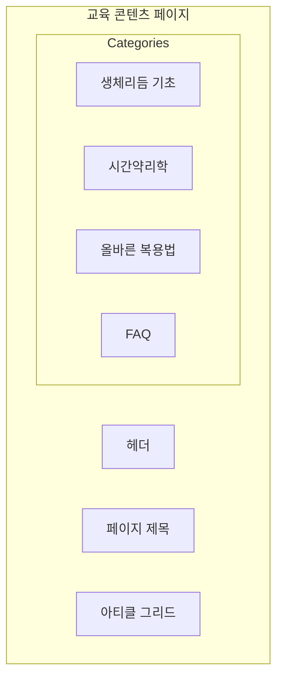

**레이아웃**: 최대 너비 1200px

**1. 페이지 제목**
```
📚 교육 콘텐츠

약과 생체리듬에 대해 알아보세요
```
- 제목: 32px, Bold
- 부제: 18px, #6B7280

**2. 카테고리 탭**
- 배경: 흰색
- 높이: 64px
- 테두리: 1px solid #E5E7EB
- 마진 하단: 32px

**탭 항목**:
```
[생체리듬 기초] [시간약리학] [올바른 복용법] [FAQ]
```
- 폰트: 16px, Medium
- 선택된 탭: 세이지 그린, 하단 바

**3. 아티클 그리드 (3열)**

**각 아티클 카드**:
- 너비: 32%
- 배경: 흰색
- 테두리: 1px solid #E5E7EB
- 둥근 모서리: 12px
- 호버: 위로 올라가는 애니메이션
- 커서: pointer

**카드 구성**:
```
[썸네일 이미지 영역]
- 높이: 200px
- 배경: 그라데이션 또는 일러스트

[카드 콘텐츠]
- 패딩: 24px

카테고리 뱃지: "생체리듬"
제목: "혈압은 왜 아침에 높을까요?"
요약: "혈압의 일중 변화 패턴과 복용 시간의 관계에 대해 알아봅니다."
읽는 시간: "5분"

[더 읽기 →]
```

**카테고리 뱃지**:
- 배경: #E8F0EC
- 텍스트: #7FA99B
- 패딩: 4px 12px
- 둥근 모서리: 12px
- 폰트: 12px, Bold

**4. 주요 콘텐츠 예시**

**콘텐츠 1: 혈압과 생체리듬**
```
📊 혈압은 왜 아침에 높을까요?

[그래프 이미지]
- 24시간 혈압 변화 곡선

내용:
혈압은 하루 중 시간대에 따라 자연스럽게 변합니다.
일반적으로 아침 기상 후 혈압이 급격히 상승하며...

• 아침 혈압 서지 (Morning Surge)
• 야간 혈압 감소 (Dipping)
• 개인차와 패턴

[다음 읽을 콘텐츠: "혈압약, 언제 먹어야 할까요?"]
```

**콘텐츠 2: 시간약리학 소개**
```
🔬 시간약리학이란?

약의 효과가 복용 시간에 따라 달라진다는 사실, 알고 계셨나요?

• 시간약리학 (Chronopharmacology) 정의
• 약물 흡수율의 시간대별 차이
• 대사 속도의 변화
• 실제 적용 사례
```

**콘텐츠 3: FAQ**
```
❓ 자주 묻는 질문

Q1. 약을 먹는 시간을 깜빡했어요. 어떻게 하나요?
A1. 일반적으로 생각난 즉시 복용하되...

Q2. 아침약을 저녁에 먹으면 어떻게 되나요?
A2. 약의 종류에 따라 다릅니다...

Q3. 시간이 정확하지 않아도 되는 약이 있나요?
A3. 네, 많은 약들이 정확한 시간보다는...
```

**5. 검색 기능**
- 우측 상단
- 검색창: "궁금한 내용을 검색하세요"
- 자동완성 기능

---

### 4.4.3 마이페이지 / 설정

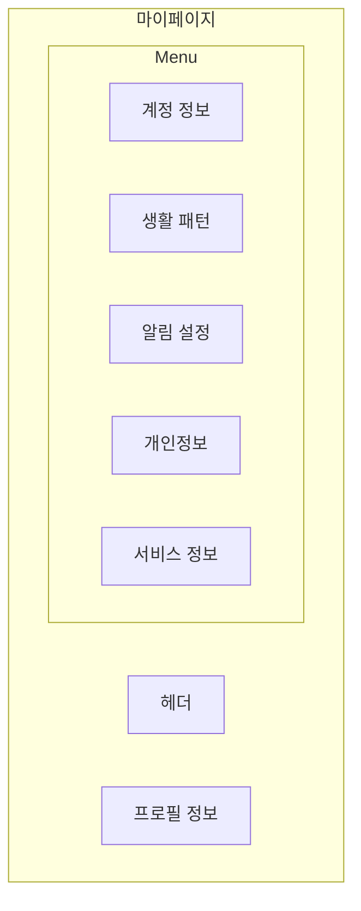

**레이아웃**: 2열 (사이드바 메뉴 25% + 메인 콘텐츠 75%)

**1. 프로필 카드**
- 전체 너비
- 배경: 그라데이션 (#E8F0EC → #D4E5DC)
- 패딩: 40px
- 둥근 모서리: 16px
- 마진 하단: 32px

**내용**:
```
[프로필 사진]   김영수님
100x100px       kys@email.com
                가입일: 2026.01.15
```

**2. 사이드바 메뉴**

```
⚙️ 설정

▸ 계정 정보
▸ 생활 패턴
▸ 알림 설정
▸ 개인정보 관리
▸ 서비스 정보
▸ 로그아웃
```

**스타일**:
- 배경: #E8EBE5
- 패딩: 24px
- 둥근 모서리: 12px
- 각 항목: 48px 높이
- 선택된 항목: 세이지 그린 배경

**3. 메인 콘텐츠 영역**

**3.1 계정 정보**
```
👤 계정 정보

이메일
─────────────────
kys@email.com
[변경하기]

비밀번호
─────────────────
••••••••••
[변경하기]

이름
─────────────────
김영수
[수정하기]

전화번호 (선택)
─────────────────
010-1234-5678
[수정하기]

[저장하기] 버튼
```

**3.2 생활 패턴**
```
⏰ 생활 패턴

현재 설정된 패턴

기상 시간: 07:00
취침 시간: 23:00
아침 식사: 08:00
점심 식사: 12:00
저녁 식사: 18:00

[수정하기] 버튼
→ 생활 패턴 설정 페이지로 이동
```

**3.3 알림 설정**
```
🔔 알림 설정

복용 시간 알림
[━━━━━━━━━━] ON
복용 예정 10분 전 알림을 받습니다

새로운 교육 콘텐츠
[━━━━━━━━━━] ON
새로운 콘텐츠가 추가되면 알림을 받습니다

상호작용 경고
[━━━━━━━━━━] ON
약물 상호작용이 발견되면 알림을 받습니다

마케팅 정보 수신
[━━━━━━━━━━] OFF
이벤트 및 혜택 정보를 받습니다

[저장하기] 버튼
```

**토글 스위치**:
- ON: 세이지 그린 (#7FA99B)
- OFF: 회색 (#D1D5DB)

**3.4 개인정보 관리**
```
🔒 개인정보 관리

데이터 다운로드
─────────────────
내가 등록한 약물 목록과 설정 데이터를
다운로드할 수 있습니다.
[다운로드하기]

데이터 삭제
─────────────────
등록된 모든 약물과 복용 기록을 삭제합니다.
(이 작업은 되돌릴 수 없습니다)
[데이터 삭제]

회원 탈퇴
─────────────────
회원 탈퇴 시 모든 데이터가 영구 삭제됩니다.
[회원 탈퇴]
```

**위험한 액션**:
- 빨간색 텍스트
- 확인 모달 필수

**3.5 서비스 정보**
```
ℹ️ 서비스 정보

버전: 1.0.0

[이용약관]
[개인정보 처리방침]
[면책 조항]
[오픈소스 라이선스]
[문의하기]
```

**4. 확인 모달 (데이터 삭제/탈퇴 시)**

```
┌─────────────────────────┐
│  ⚠️ 정말 삭제하시겠습니까? │
│                         │
│  이 작업은 되돌릴 수      │
│  없습니다.               │
│                         │
│  [취소]      [삭제하기]  │
└─────────────────────────┘
```

**모달 스타일**:
- 배경: 반투명 검은색 (#000000 80%)
- 모달 카드: 흰색, 최대 너비 400px
- 중앙 정렬
- 그림자: 0 20px 25px rgba(0,0,0,0.15)

---

## 5. 반응형 디자인 고려사항

### 5.1 브레이크포인트

- **Desktop**: 1200px 이상
- **Tablet**: 768px ~ 1199px
- **Mobile**: 768px 미만

### 5.2 모바일 최적화

**헤더**:
- 햄버거 메뉴로 변경
- 로고만 표시

**그리드 레이아웃**:
- 3열 → 2열 → 1열 자동 조정

**카드**:
- 패딩 축소 (32px → 20px)
- 폰트 크기 조정

**버튼**:
- 터치 영역 최소 48px

---

## 6. 컴포넌트 라이브러리

### 6.1 버튼

**Primary 버튼**:
```
배경: #7FA99B (세이지 그린)
텍스트: 흰색
높이: 48px ~ 56px
패딩: 16px 32px
둥근 모서리: 8px
호버: #6B8E7F (진한 세이지)
```

**Secondary 버튼**:
```
배경: 흰색
텍스트: #7FA99B
테두리: 2px solid #7FA99B
높이: 48px ~ 56px
호버: 배경 #E8F0EC
```

**Danger 버튼**:
```
배경: #D48A88 (부드러운 코랄)
텍스트: 흰색
호버: #C67876
```

### 6.2 입력 필드

```
높이: 48px
테두리: 1px solid #D1D5DB
둥근 모서리: 8px
패딩: 12px 16px
폰트: 16px

포커스:
- 테두리: 2px solid #7FA99B
- 아웃라인: 4px #E8F0EC

에러:
- 테두리: 2px solid #D48A88
- 에러 메시지: 14px, #D48A88
```

### 6.3 카드

```
배경: 흰색
테두리: 1px solid #E5E7EB
둥근 모서리: 12px
패딩: 24px
그림자: 0 1px 3px rgba(0,0,0,0.1)

호버:
- 그림자: 0 4px 12px rgba(0,0,0,0.15)
- 위로 2px 이동
```

### 6.4 고지 배너

```
정보 (Info):
- 배경: #E8F0EC
- 텍스트: #3A4045
- 아이콘: ℹ️

경고 (Warning):
- 배경: #FEF8E7
- 텍스트: #8B6914
- 아이콘: ⚠️

위험 (Danger):
- 배경: #FADBD8
- 텍스트: #8B4543
- 아이콘: ❗

성공 (Success):
- 배경: #E3F0E8
- 텍스트: #4A6B4F
- 아이콘: ✅
```

---

## 7. 인터랙션 및 애니메이션

### 7.1 페이지 전환
- 부드러운 페이드 인 (300ms)
- 콘텐츠 위로 슬라이드 (20px)

### 7.2 호버 효과
- 버튼: 색상 변화 (200ms)
- 카드: 그림자 + 이동 (250ms)
- 링크: 색상 변화 (150ms)

### 7.3 로딩 상태
- 스켈레톤 UI
- 스피너: 세이지 그린 회전 애니메이션

### 7.4 알림/토스트
- 우측 상단에서 슬라이드 인
- 3초 후 자동 사라짐
- 닫기 버튼 제공

---

## 8. 접근성 (Accessibility)

### 8.1 키보드 네비게이션
- 모든 인터랙티브 요소 탭 접근 가능
- 포커스 인디케이터 명확히 표시
- 논리적인 탭 순서

### 8.2 색상 대비
- WCAG AA 기준 준수
- 최소 대비율 4.5:1

### 8.3 스크린 리더
- 시맨틱 HTML 사용
- ARIA 레이블 제공
- 이미지 대체 텍스트

### 8.4 폰트 크기
- 최소 14px
- 확대 가능 (200%까지)

---

## 9. 개발 우선순위

### Phase 1: MVP (Core Features)
1. 랜딩 페이지
2. 로그인/회원가입
3. 약 검색
4. 약 상세 정보
5. 복용 시간 추천 결과

### Phase 2: User Management
6. 대시보드
7. 내 약 목록
8. 생활 패턴 설정

### Phase 3: Advanced Features
9. 복용 시간표
10. 약물 상호작용
11. 교육 콘텐츠
12. 마이페이지

---

## 10. 다음 단계

이 와이어프레임을 바탕으로:
1. ✅ 와이어프레임 완성 (현재 문서)
2. 🎨 UI 디자인 시안 제작
3. 🎭 프로토타입 제작 (Figma 등)
4. 💻 프론트엔드 개발
5. 🔌 백엔드 API 연동
6. 🧪 사용성 테스트

---

**문서 버전**: 1.0  
**최종 수정일**: 2026년 1월 22일  
**작성 목적**: 개발 및 디자인 가이드

---

## 부록: 추가 고려사항

### A. 다크 모드 (선택사항)
- 색상 팔레트 다크 버전 정의
- 자동 전환 또는 수동 토글

### B. 다국어 지원 (향후)
- 영어, 중국어 등
- i18n 구조 준비

### C. PWA (Progressive Web App)
- 오프라인 지원
- 홈 화면 추가
- 푸시 알림

### D. 성능 최적화
- 이미지 지연 로딩
- 코드 스플리팅
- 캐싱 전략
